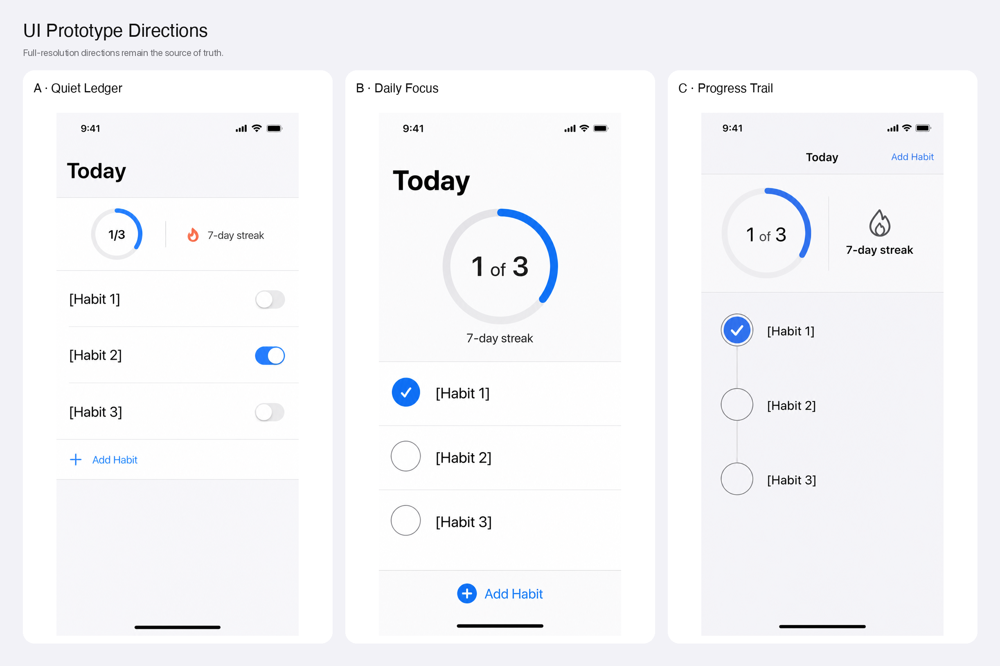

# Prototype Native UI with Image Generation

Explore multiple native Apple or Android UI directions with Codex image generation, evaluate them against the real product, and rebuild only an explicitly selected direction in SwiftUI or Jetpack Compose.

The skill is designed for product work, not mood-board generation. It inspects the current implementation and runtime state, freezes product invariants, generates intentionally different directions, rejects unsupported UI, asks an independent subagent to critique the results, and gives a decision-ready recommendation.

It works directly in Codex and does not require Claude, Fable, an external MCP server, or a separate image-generation API key.

## Example output

The skill presents every full-resolution direction individually and also creates a labeled comparison sheet:



The sheet is composed locally from the original generated images. It does not use image generation or local ML, so it cannot redraw or hallucinate details. The included `make_contact_sheet.py` script uses Python and Pillow to resize, label, and arrange the images.

The example above is intentionally preserved as a real forward-test artifact. Its review found that all three concepts invented an unconfirmed `1/3` progress state and did not show the same completed habit. The updated skill treats that as a hard comparability failure rather than recommending the prettiest image.

## What the skill returns

An Explore or Riff run produces:

1. A screenshot-backed or source-informed audit of the current UI
2. A frozen product brief and preservation map
3. Three directions by default, or up to five when explicitly requested
4. Full-resolution images plus one labeled comparison sheet
5. Native component maps for SwiftUI or Jetpack Compose
6. A `Pass / Concern / Fail` comparison with explained tradeoffs
7. An independent subagent review
8. A recommendation, important pitfalls, and confidence level
9. Detailed next steps and appropriate downstream skill handoffs
10. An explicit choice: `riff <name>`, `keep <name>`, or `stop`

Still images are never treated as proof of motion, gestures, haptics, accessibility semantics, localization, restoration, or runtime performance.

## Design strategies

Unless you request one strategy explicitly, a three-direction run explores:

- **System-native** — conservative use of current project and semantic platform components
- **Hybrid-native** — native system behavior with custom content components or visualizations
- **Custom-native** — a more ownable visual language implemented with real SwiftUI or Compose primitives

The app shell remains preserved by default. A custom content direction does not silently authorize redesigned tabs, navigation, symbols, brand colors, or product behavior.

## Modes

### Explore

Generate three directions, compare them, recommend the strongest eligible direction, and stop before changing production code.

```text
Use $prototype-ui-with-imagegen to explore three redesign directions for the
Today screen. Preserve the existing tab bar, navigation, product copy, actions,
brand color, and all current content modules.
```

### Explore five directions

```text
Use $prototype-ui-with-imagegen x5 for the workout summary screen. Keep the
current behavior and data, but explore meaningfully different hierarchy,
density, and spatial organization.
```

### System-native only

```text
Use $prototype-ui-with-imagegen to create three system-native alternatives for
this settings screen. Prefer current platform components and do not introduce
custom controls.
```

### Custom-native only

```text
Use $prototype-ui-with-imagegen to create three custom-native directions for
the Home content surface. Preserve the system tab and navigation shell, but
make the content hierarchy more ownable and distinctive. No CSS, HTML, or
raster production UI.
```

### Riff on a direction

After reviewing the first run:

```text
riff Quiet Ledger
```

The skill preserves the chosen concept’s successful principles and generates three focused alternatives that change only one or two named aspects.

### Keep and implement

After explicitly selecting an eligible direction:

```text
keep Quiet Ledger
```

The skill rebuilds the direction as native SwiftUI or Jetpack Compose, runs the app, captures the same state, checks relevant alternate states and accessibility settings, and reports intentional visual differences. A generated screenshot is never shipped as the interface.

### Start from an attached screenshot

```text
Use $prototype-ui-with-imagegen on the attached screenshot. Treat it as the
current edit target, audit the visible hierarchy and problems first, then
generate three native alternatives. Preserve all visible product functions and
do not invent controls or copy.
```

### Start without a runnable app

```text
Use $prototype-ui-with-imagegen to explore this new SwiftUI onboarding screen
from the supplied product brief. Clearly label the current-state analysis as
brief-informed and do not claim runtime validation.
```

## Contact-sheet utility

The skill runs the utility automatically after the final directions are accepted:

```bash
python3 scripts/make_contact_sheet.py \
  --item "A · Quiet Ledger=/absolute/path/quiet.png" \
  --item "B · Daily Focus=/absolute/path/focus.png" \
  --item "C · Progress Trail=/absolute/path/trail.png" \
  --output /absolute/path/prototype-directions.png
```

The output is deterministic for the same inputs and parameters: the script performs ordinary local image composition, not inference. It supports two to five input images.

## Requirements

- Codex with built-in image generation
- A native Apple or Android project for implementation-backed work
- A working simulator or emulator for runtime-verified redesigns
- Python 3 and Pillow for the local comparison sheet
- The applicable `apple-design` or `android-design` skill when available

If the current app cannot be built or captured, exploration may continue from source evidence, but the skill must lower confidence and cannot declare a literal winner without a current screenshot or runtime baseline.

## Safety and scope

- Explore and Riff are read-only with respect to the application repository.
- Generated images remain references, never production UI assets.
- Product capabilities, copy, navigation, controls, metrics, and states must come from the repository or user.
- The skill preserves unrelated changes and commits only when explicitly requested.
- Web, HTML, CSS, WebView, and browser-based variant pickers are out of scope.

## Files

- `SKILL.md` — complete workflow and guardrails
- `references/` — prompting, native component, evaluation, output, implementation, and validation guidance
- `scripts/make_contact_sheet.py` — local labeled image-sheet composer
- `assets/prototype-directions-example.png` — real forward-test comparison sheet
